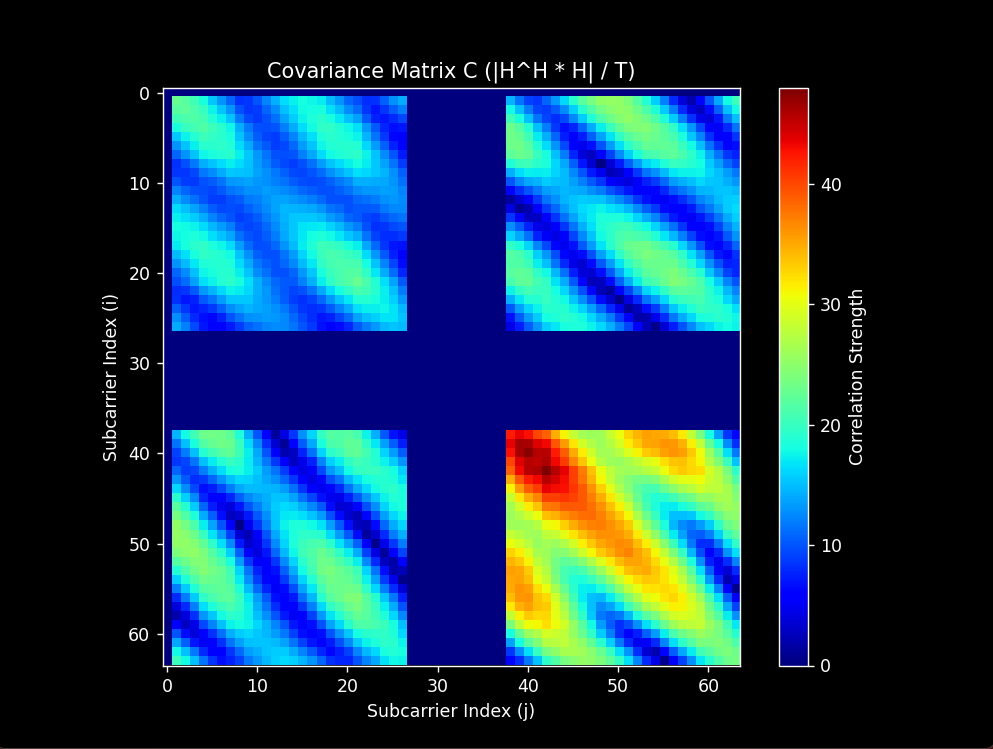
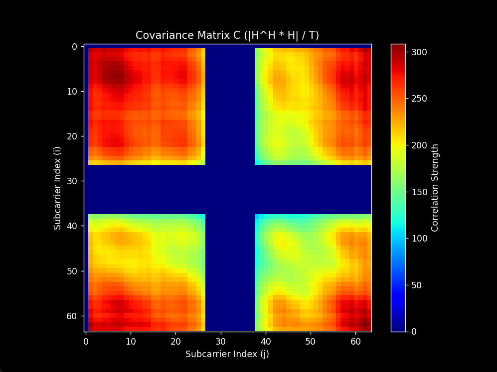
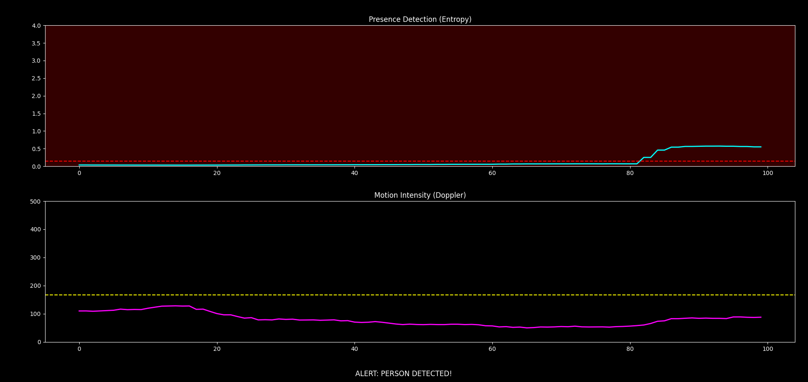
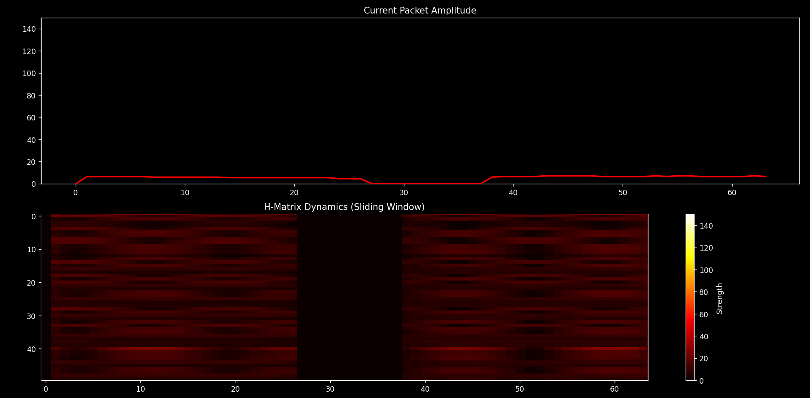
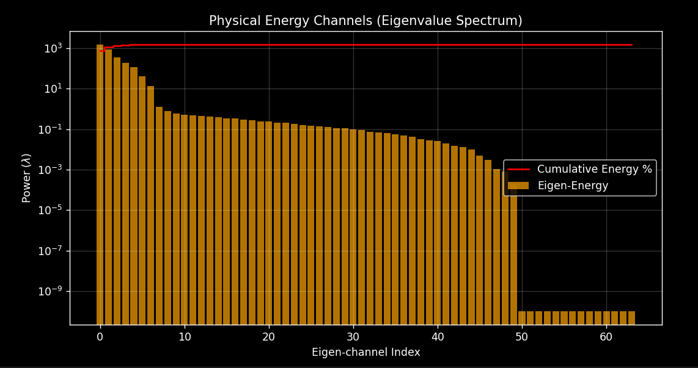

# 👁️ Invisible Eye

**Device-free human presence & motion sensing via Wi-Fi CSI subspace analysis.**

[](https://www.python.org/)
[](LICENSE)
[]()

No camera. No wearable. No motion sensor. Just an ordinary Wi-Fi radio.

**Invisible Eye** turns a CSI-capable Wi-Fi device into a presence and motion
"radar" by analyzing the **Channel State Information (CSI)** of the wireless
link. It treats the channel as a thermodynamic system: an empty room keeps
signal energy concentrated in a few stable propagation paths (low entropy),
while a human body scatters and diffracts the signal, spreading that energy
across many more paths (high entropy). By tracking how *disordered* the
channel becomes, the system tells apart an **empty room**, **static human
presence**, and **dynamic motion** — in real time, through walls and
furniture, with hardware that costs a few dollars.

---

## Gallery

| Empty room — energy stays in 1–2 dominant paths | Human present — energy scatters across the spectrum |
|:---:|:---:|
|  |  |

| Live alert console | Raw amplitude + sliding H-matrix |
|:---:|:---:|
|  |  |

| Eigenvalue spectrum — one dominant "energy channel" decaying into a noise floor |
|:---:|
|  |

---

## How it works

1. A CSI-capable Wi-Fi device (e.g. an **ESP32** running CSI-extraction
   firmware) streams `CSI_DATA[...]` lines over serial, one OFDM
   amplitude/phase packet at a time.
2. A sliding window of `T` packets across `N` subcarriers forms the channel
   matrix **H**.
3. The sample covariance matrix **C = Hᴴ H / T** is computed and
   eigen-decomposed, splitting the channel into a small *signal subspace*
   and a larger *noise subspace*.
4. Two metrics are derived every frame:
   - **Spectral Entropy (S)** — Shannon entropy of the normalized eigenvalue
     distribution. Low `S` → energy concentrated in one eigen-channel
     (static/empty room). High `S` → energy spread across many eigen-channels
     (human-disturbed channel).
   - **Doppler Spread (D)** — mean squared distance between consecutive CSI
     vectors; a proxy for how fast the channel is changing (motion speed).
5. The system **self-calibrates**: it watches an assumed-empty room for a
   configurable number of frames and sets alert thresholds at
   `mean + 3·std` of that baseline — so it adapts to your room and hardware
   instead of relying on fixed, hand-tuned constants.
6. Every frame after calibration is classified as:

   | State | Condition |
   |---|---|
   | `SYSTEM READY: EMPTY` | `S` below threshold |
   | `ALERT: PERSON DETECTED` | `S` above threshold, `D` below threshold (static body) |
   | `ALERT: MOTION DETECTED` | `S` and `D` both above threshold (moving body) |

The full mathematical derivation — including the proof that eigenvalues
represent projected signal power along orthogonal propagation paths — is
written up in the accompanying paper, *Invisible Eye: Subspace Analysis of
Wi-Fi CSI for Human Sensing*.

---

## Project layout

```
invisible_eye/
├── main.py                   # CLI entry point
├── requirements.txt
├── invisible_eye/            # the package
│   ├── __init__.py           # public API
│   ├── config.py             # RadarConfig: all tunable settings
│   ├── serial_interface.py   # CSIReader: serial I/O + packet parsing
│   ├── csi_math.py           # covariance, eigen-decomposition, entropy, Doppler
│   ├── calibration.py        # Calibrator: baseline -> alert thresholds
│   ├── decision_engine.py    # DecisionEngine: (S, D) -> SystemState
│   └── dashboard.py          # LiveDashboard: 3-panel live matplotlib UI
├── README.md
└── AUDIT_REPORT.md           # engineering notes: notebook -> package refactor
```

This package is a refactor of an exploratory research notebook into a small,
importable Python package with a CLI entry point. See
[`AUDIT_REPORT.md`](AUDIT_REPORT.md) for a detailed account of every issue
found in the original notebook and how it was fixed.

---

## Hardware requirements

- A Wi-Fi CSI source that emits ASCII lines containing `CSI_DATA` and a
  bracketed list of interleaved `I,Q` integers — e.g. an **ESP32** running
  CSI-extraction firmware, connected to your computer over USB serial.
- The default configuration assumes **64 subcarriers**; pass
  `--subcarriers` to match your firmware's CSI payload size.

---

## Installation

```bash
git clone https://github.com/MohamedAlaaCommAI/invisible-eye.git
cd invisible-eye
python -m venv .venv
source .venv/bin/activate        # Windows: .venv\Scripts\activate
pip install -r requirements.txt
```

## Usage

```bash
# Windows
python main.py --port COM9 --baud 921600

# Linux / macOS
python main.py --port /dev/ttyUSB0 --baud 921600

# Tune the sliding window, calibration length, and refresh rate
python main.py --port COM9 --window 50 --subcarriers 64 \
                --calibration-frames 50 --interval 30
```

On startup the dashboard will:

1. Open a 3-panel window — raw CSI amplitude, Spectral Entropy over time,
   and Doppler Spread over time.
2. Show **`CALIBRATING: x/N`** while it learns the empty-room baseline —
   keep the room empty during this phase.
3. Switch to live classification, with the status banner reading
   `SYSTEM READY: EMPTY`, `ALERT: PERSON DETECTED`, or `ALERT: MOTION
   DETECTED`.

Press `Ctrl+C` in the terminal, or close the plot window, to stop.

### Using the package programmatically

```python
from invisible_eye import RadarConfig, CSIReader, LiveDashboard

config = RadarConfig(serial_port="COM9", baud_rate=921600)
reader = CSIReader(config)
dashboard = LiveDashboard(config, reader)
dashboard.run()
```

Or run just the math pipeline on your own logged CSI data — no serial
hardware or plotting required:

```python
from collections import deque
from invisible_eye import build_h_matrix, process_window

window = deque(your_list_of_complex_csi_vectors, maxlen=50)
H = build_h_matrix(window)
covariance, eigenvalues, entropy, doppler = process_window(H)
```

## Command-line options

| Flag | Default | Description |
|---|---|---|
| `--port` | `COM9` | Serial port of the CSI device |
| `--baud` | `921600` | Serial baud rate |
| `--subcarriers` | `64` | Number of OFDM subcarriers (N) |
| `--window` | `50` | Sliding window size in packets (T) |
| `--calibration-frames` | `50` | Baseline frames used to learn thresholds |
| `--std-multiplier` | `3.0` | Threshold = mean + k·std of the baseline |
| `--interval` | `30` | Plot refresh interval (ms) |
| `-v`, `--verbose` | off | Enable debug-level logging |

---

## Known limitations

- Validated against synthetic data during the package refactor; **not yet
  validated end-to-end against a real ESP32 CSI stream**. Confirm the exact
  `CSI_DATA[...]` line format your firmware emits, and re-calibrate in your
  own room before relying on the alerting for anything safety-critical.
- Thresholds are learned per-session from an assumed-empty baseline — if the
  room isn't actually empty during calibration, detection quality will
  suffer.
- See [`AUDIT_REPORT.md`](AUDIT_REPORT.md) for the full list of design
  decisions and trade-offs.

## Contributing

Issues and pull requests are welcome — especially real-world test reports
from different ESP32 CSI firmware builds and room layouts.

## License

MIT — see [`LICENSE`](LICENSE).

## Author

Built by [**Mohamed Alaa**](https://github.com/MohamedAlaaCommAI).
